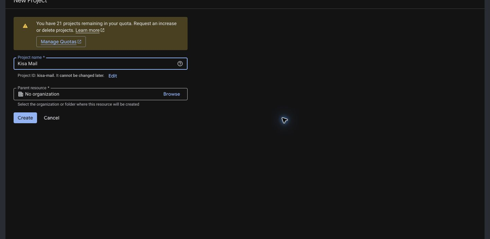
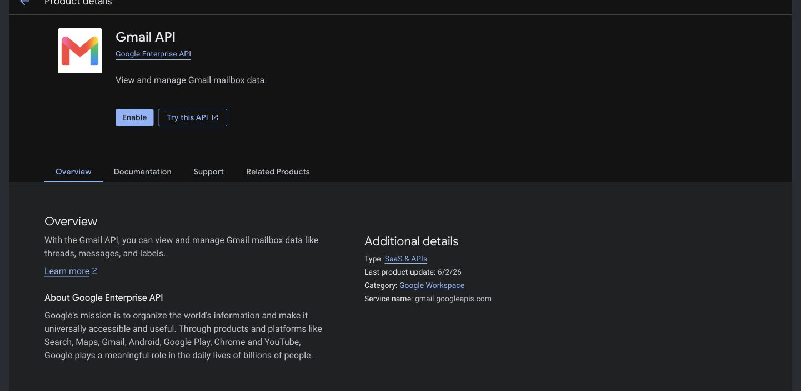
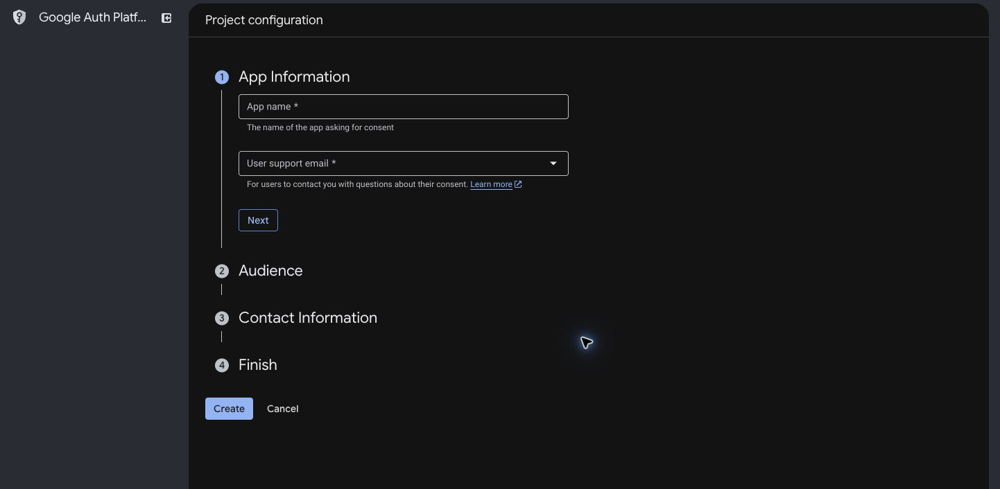
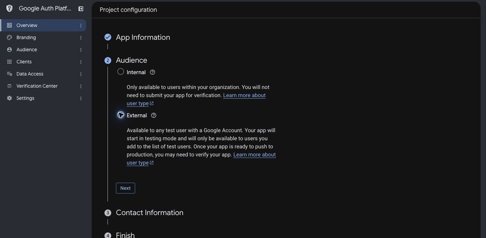
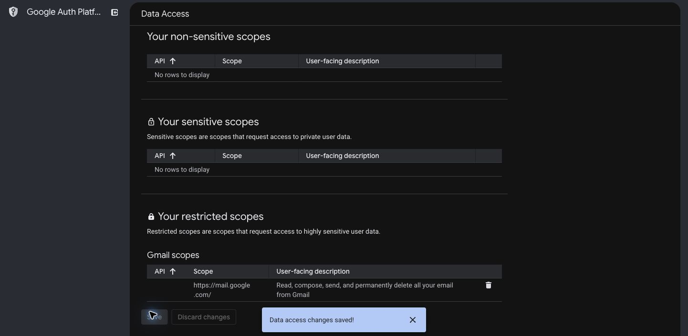
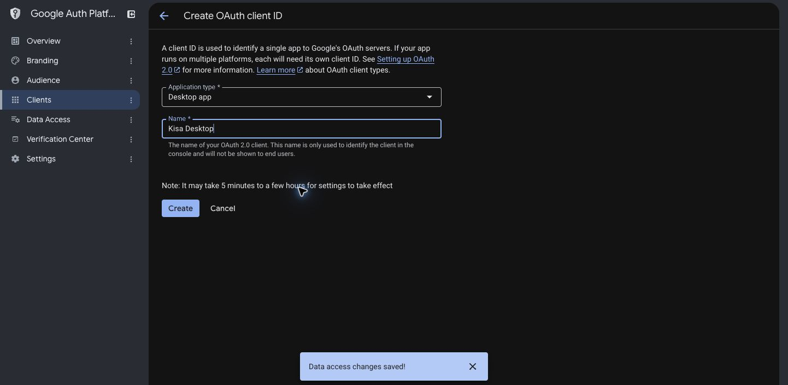
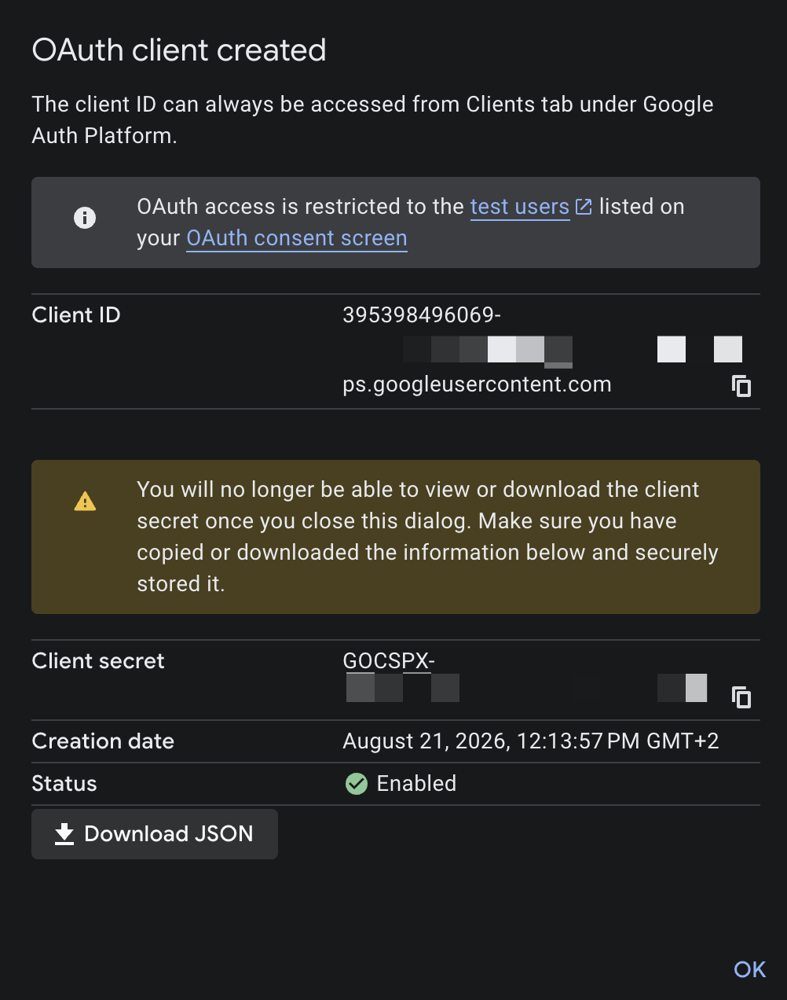
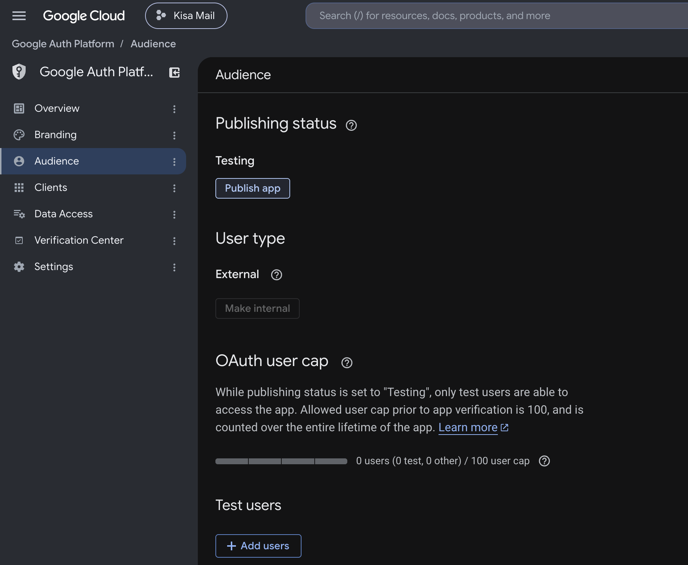

# Connect Kisa to Google

Kisa does not operate an OAuth service or any other server. To connect Gmail, create a Desktop OAuth client in your own Google Cloud project and give Kisa the JSON file that Google generates.

Kisa requests `https://mail.google.com/`. The full scope is required for **Delete forever** in Spam. Google classifies this as a restricted scope. Personal projects used only by their owner can remain unverified, but Google shows a warning during authorization.

## 1. Create a project

1. Open [Google Cloud project creation](https://console.cloud.google.com/projectcreate).
2. Sign in with the Google account that will own the OAuth client.
3. Name the project `Kisa Mail`, leave **Parent resource** as **No organization**, and select **Create**.
4. Open the [Gmail API page](https://console.cloud.google.com/apis/library/gmail.googleapis.com) for that project and select **Enable**.

## 2. Configure Google Auth Platform

Open [Google Auth Platform](https://console.cloud.google.com/auth/overview) and select the project you created.

Select **Get started**. Under App Information:

1. Enter `Kisa Mail` as the app name.
2. Select your Google account as the user support email.
3. Select **Next**.

### Audience

Set the audience to **External**.

Select **Next**, enter your Google account email under Contact Information, accept the Google API Services User Data Policy, and finish creating the configuration.

### Data Access

Add the following scopes:

- `openid`
- `https://www.googleapis.com/auth/userinfo.email`
- `https://www.googleapis.com/auth/userinfo.profile`
- `https://mail.google.com/`

The first three identify the connected account and load its name and avatar. The Gmail scope reads and manages mail, sends mail, and allows immediate permanent deletion from Spam.

Select **Add or remove scopes**. Choose the first three scopes from the table. If the full Gmail scope is not listed, paste it under **Manually add scopes** and select **Add to table**. Finish with **Update**, then **Save**.

## 3. Create a Desktop OAuth client

1. Open **Clients** in Google Auth Platform.
2. Select **Create client**.
3. Choose **Desktop app** as the application type.
4. Name it `Kisa Desktop`.
5. Create the client.
6. In the success dialog, select **Download JSON** before closing it. Google does not show the client secret again after that dialog closes.

The file must contain an `installed` section. A client created as **Web application** will not work because its redirect model is different.

## 4. Publish the app

Open **Audience**, select **Publish app**, and confirm. The publishing status should change from **Testing** to **In production**. Publishing makes the app available beyond test users; it does not submit the project for Google verification.

## 5. Connect the account

1. In Kisa, select **Setup Google**.
2. Follow the displayed instructions, select **Upload credentials JSON**, and choose the file downloaded from Google. You only need to upload it once.
3. After setup completes, select **Login with Google**.
4. Kisa opens Google's authorization page in your default browser.
5. Sign in to an account allowed by the project's Audience settings.
6. Review the requested access and finish authorization.

Kisa reads the file in Electron's main process. The JSON contents never enter the renderer. Kisa encrypts the OAuth client with Electron `safeStorage` and saves it once on this device. Access and refresh tokens are encrypted separately with each connected account.

When you add another account, Kisa reuses the saved Desktop client and opens Google sign-in directly. Every account uses the same Google Cloud project and consent configuration. Existing accounts retain the client identity that issued their refresh token.

## Troubleshooting

### Access blocked or app not configured

Confirm that the audience is **External**, the publishing status is **In production**, the Gmail API is enabled, and the OAuth client type is **Desktop app**.

### Account must be connected again

Download the current Desktop client JSON and connect that Gmail account again. Deleting the OAuth client, changing projects, or revoking access invalidates the saved grant.

### Remove access

Disconnecting an account in Kisa attempts to revoke its Google token and then deletes that account's local credentials, cache, index, settings, and trusted sender data. You can also revoke the project from your Google Account's third-party access settings.
